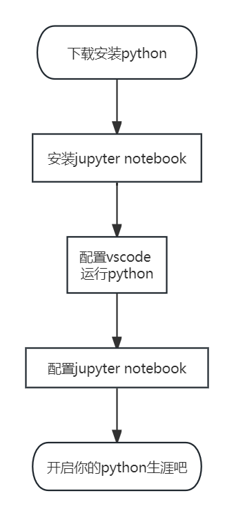
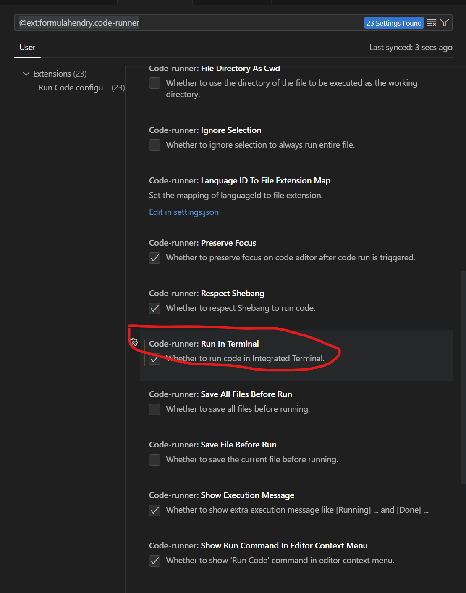

# Jupyter Notebook 配置教学

>1. 下载安装Python环境
>2. 安装Jupyter Notebook
>3. 配置VSCode运行Python
>4. 配置Jupyter Notebook



## 1.下载安装python环境
长期支持版
Python 3.11.4
Release Date: June 6, 2023
>[python macOS版本](https://www.python.org/ftp/python/3.11.4/python-3.11.4-macos11.pkg)
[python Windows版本 64位](https://www.python.org/ftp/python/3.11.4/python-3.11.4-amd64.exe)
[python Windows版本 32位](https://www.python.org/ftp/python/3.11.4/python-3.11.4.exe)

下载完成后可通过Win+R快捷键调用运行界面，并输入cmd打开命令行Bash窗口，可输入:
``````Bash
python -V
``````
或
``````Bash
python -version
``````
查看python版本，若与下载版本号相同，即为下载成功。

## 2.安装Jupyter Notebook
>注：在安装Jupyter Notebook前请确保已安装pip，python安装过程中有选项可以默认安装与python版本相对应的pip 如若未安装，可通过 [pip官网](https://pypi.org/project/pip/) 安装与python版本相对应的版本

通过Win+R快捷键调用运行界面，并输入cmd打开命令行Bash窗口，输入:
``````Bash
pip install jupyter
``````
安装后，输入:
``````Bash
jupyter notebook
``````
如果跳转至jupyter notebook的网站界面，即为安装成功。

## 3. 配置VSCode运行Python
>配置VSCode运行Python

①、打开VSCode，安装Python插件：
>Ctrl+Shift+X，搜索"Python"，安装Python插件。
搜索"Code Runner"，安装Code Runner插件，并点击右下角的齿轮中的Extention Settings，勾选其中的Run In Terminal。




②、进行python环境配置：
>Ctrl+Shift+P,输入python，点击Python:Select Interpreter，选择python的开发环境，与你安装的版本相对应即可。

③测试Python: 
>在VSCode编辑器中新开文件，输入 print("我爱BJUT,我爱开源！")，右键点击Run Code即可运行！如果终端正常输出 我爱BJUT,我爱开源！即安装成功。

## 4. 配置Jupyter Notebook
只需要创建.ipynb文件，就可以编辑notebook了。或是点击左上角的File，New File中找到Jupyter Notebook。

>注：如上，1处是添加代码块，点击2可变为markdown，3处是切换服务器，一般不用改直接本地就行，4是选择编译环境。 编辑好代码之后直接运行就好。

## 后记：

Jupyter 是一个非常流行的开源项目，它提供了一个交互式计算环境，让您能够在网页浏览器中创建和分享包含代码、文本、图像、公式和可视化的文档。它的名字取自三种核心编程语言：Julia、Python 和 R（即 Ju-Pyt-e-R）。

主要特点：

1. **交互性**：您可以在浏览器中逐个代码单元（称为单元格）地运行代码，即时查看结果。这种实时反馈非常适合学习、调试和数据探索。

2. **支持多种编程语言**：虽然 Jupyter 最初是为 Python 设计的，但现在它支持超过 100 种编程语言，这使得您能够在同一个环境中使用您喜欢的语言。

3. **交互性文档**：Jupyter 文档被称为“笔记本”（Notebooks），它们既可以包含代码和输出，又可以包含富文本、数学公式、图表和可视化。这使得 Jupyter 成为交互式数据分析和展示的绝佳工具。

4. **易于分享**：您可以轻松地分享您的 Jupyter 笔记本，无论是通过导出为 HTML、PDF 或通过在线共享服务（例如 GitHub、Google Colab 或 Jupyter Notebook Viewer）。

5. **广泛应用**：Jupyter 可以用于数据清理、数据分析、机器学习、科学计算、教学和其他许多领域。

请注意，Jupyter Notebook 并不是唯一的 Jupyter 项目。Jupyter 生态系统还包括 Jupyter Lab，它提供了更灵活的界面和功能，以及 JupyterHub，用于在服务器上部署 Jupyter 环境。

希望这个简介能让您对 Jupyter 有一个初步的了解。祝您在使用 Jupyter 进行编程和数据分析时取得愉快的体验！如果您有任何问题，请随时练习我们。
